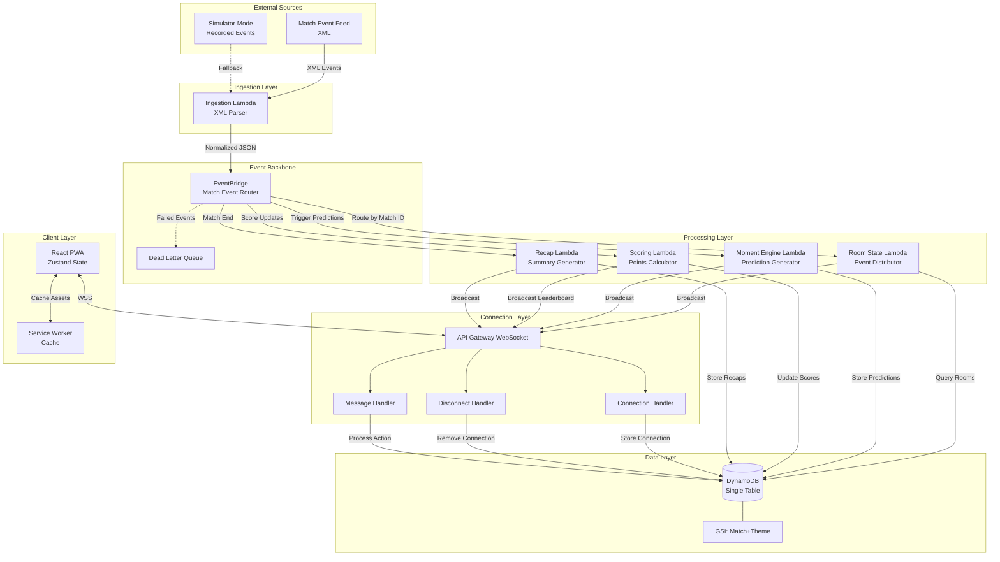

# Design Document: PulseParty Rooms

## Overview

PulseParty Rooms is a real-time social multiplayer fan experience platform that transforms live football matches into interactive watch parties. The system enables fans to join themed rooms, engage with live match events, participate in micro-predictions, compete on leaderboards, and receive personalized match recaps.

The architecture follows an event-driven design with a serverless backend on AWS, leveraging EventBridge as the central nervous system for match event routing. The frontend is a mobile-first Progressive Web Application built with React, optimized for low-latency real-time updates via WebSocket connections.

### Key Design Goals

1. **Real-time responsiveness**: Match events broadcast to all room participants within 500ms
2. **Scalability**: Support multiple concurrent match rooms with 2+ users each
3. **Resilience**: Graceful degradation with simulator mode fallback
4. **Accessibility**: Guest mode, low-bandwidth mode, and multilingual support (EN/FR/DE/SW)
5. **Mobile-first**: PWA with offline capabilities and optimized performance

### Technology Stack

- **Backend**: Node.js + TypeScript on AWS Lambda
- **Frontend**: Vite + React + TailwindCSS + Zustand
- **Real-time**: AWS API Gateway WebSockets
- **Data**: DynamoDB (single-table design with GSIs)
- **Eventing**: AWS EventBridge for match event routing
- **Auth**: Guest mode + optional AWS Cognito
- **Hosting**: S3 + CloudFront CDN
- **i18n**: react-i18next with locale detection

## Architecture

### System Architecture Diagram



### Event Flow

The system operates on an event-driven backbone:

1. **Ingestion**: Live feed or simulator → Ingestion Lambda → parse XML → normalize to JSON
2. **Routing**: Normalized event → EventBridge → route by match ID → target Lambdas
3. **Distribution**: Room State Lambda → query active rooms → broadcast via WebSocket
4. **Client Update**: WebSocket message → Zustand state update → React re-render

### Deployment Architecture

- **Frontend**: Static assets on S3, served via CloudFront with edge caching
- **Backend**: Lambda functions in VPC (if needed for future RDS integration)
- **WebSocket**: API Gateway WebSocket API with Lambda integrations
- **Data**: DynamoDB with on-demand billing for variable load
- **Monitoring**: CloudWatch Logs + X-Ray tracing for Lambda functions

## Components and Interfaces

### Backend Components

#### 1. Ingestion Lambda

**Purpose**: Parse XML match event feed and normalize to internal JSON format

**Inputs**:
- XML event feed (S3 trigger or HTTP polling)
- Simulator mode flag (environment variable)

**Outputs**:
- Normalized match event published to EventBridge

**Key Functions**:
```typescript
interface MatchEvent {
  eventId: string;
  matchId: string;
  eventType: 'goal' | 'assist' | 'yellow_card' | 'red_card' | 'substitution' | 'corner' | 'shot' | 'possession';
  timestamp: string; // ISO 8601
  teamId: string;
  playerId?: string;
  metadata: Record<string, any>;
}

async function parseXMLEvent(xml: string): Promise<MatchEvent>
async function normalizeEvent(raw: any): Promise<MatchEvent>
async function publishToEventBridge(event: MatchEvent): Promise<void>
```

**Error Handling**:
- XML parse errors: Log error with snippet, continue processing
- Missing required fields: Reject event, log validation error
- EventBridge publish failure: Retry with exponential backoff (3 attempts)

#### 2. Room State Lambda

**Purpose**: Distribute match events to appropriate rooms and manage room state

**Inputs**:
- Match event from EventBridge
- Match ID routing attribute

**Outputs**:
- WebSocket broadcast to all room participants

**Key Functions**:
```typescript
interface Room {
  roomId: string;
  roomCode: string;
  matchId: string;
  theme: 'Country' | 'Club' | 'Private';
  participants: string[]; // connection IDs
  createdAt: string;
  ttl: number; // Unix timestamp for DynamoDB TTL
}

async function getActiveRoomsByMatch(matchId: string): Promise<Room[]>
async function broadcastToRoom(roomId: string, message: any): Promise<void>
async function updateRoomState(roomId: string, state: Partial<Room>): Promise<void>
```

#### 3. Moment Engine Lambda

**Purpose**: Generate prediction windows based on match events or time intervals

**Inputs**:
- Match events from EventBridge (goal, corner, free kick)
- Scheduled CloudWatch Events (10-minute intervals)

**Outputs**:
- Prediction window broadcast to room participants
- Prediction window record in DynamoDB

**Key Functions**:
```typescript
interface PredictionWindow {
  windowId: string;
  roomId: string;
  matchId: string;
  predictionType: 'next_goal_scorer' | 'next_card' | 'next_corner' | 'match_outcome';
  options: string[];
  expiresAt: string; // ISO 8601
  createdAt: string;
}

async function generatePredictionWindow(event: MatchEvent): Promise<PredictionWindow>
async function closePredictionWindow(windowId: string): Promise<void>
async function evaluatePredictions(windowId: string, outcome: string): Promise<void>
```

#### 4. Scoring Lambda

**Purpose**: Calculate points, apply multipliers, and update leaderboards

**Inputs**:
- Prediction evaluation results from Moment Engine
- User prediction records from DynamoDB

**Outputs**:
- Updated leaderboard broadcast to room participants
- Score records persisted to DynamoDB

**Key Functions**:
```typescript
interface UserScore {
  userId: string;
  roomId: string;
  totalPoints: number;
  streak: number;
  clutchMoments: number;
  correctPredictions: number;
  totalPredictions: number;
  rank: number;
}

async function calculatePoints(prediction: Prediction, difficulty: number): Promise<number>
async function applyStreakMultiplier(basePoints: number, streak: number): Promise<number>
async function applyClutchBonus(basePoints: number, submittedAt: string, expiresAt: string): Promise<number>
async function updateLeaderboard(roomId: string): Promise<UserScore[]>
```

**Scoring Rules**:
- Base points: 10 (easy), 25 (medium), 50 (hard)
- Streak multiplier: 1.0 + (0.1 × streak), max 2.0
- Clutch bonus: 1.5× if submitted in final 10 seconds

#### 5. Recap Lambda

**Purpose**: Generate personalized and room-level match summaries

**Inputs**:
- Match end event from EventBridge
- Final leaderboard and prediction data from DynamoDB

**Outputs**:
- Wrapped recap for each user
- Room recap for the entire room
- Shareable recap data stored in DynamoDB

**Key Functions**:
```typescript
interface WrappedRecap {
  userId: string;
  roomId: string;
  matchId: string;
  totalPoints: number;
  finalRank: number;
  accuracy: number; // percentage
  longestStreak: number;
  clutchMoments: number;
  shareableUrl: string;
}

interface RoomRecap {
  roomId: string;
  matchId: string;
  totalParticipants: number;
  topPerformers: UserScore[];
  mostPredictedEvent: string;
  engagementMetrics: Record<string, number>;
}

async function generateWrappedRecap(userId: string, roomId: string): Promise<WrappedRecap>
async function generateRoomRecap(roomId: string): Promise<RoomRecap>
async function createShareableLink(recap: WrappedRecap): Promise<string>
```

#### 6. WebSocket Connection Handlers

**Purpose**: Manage WebSocket lifecycle and message routing

**Connection Handler**:
```typescript
async function handleConnect(connectionId: string, queryParams: any): Promise<void> {
  // Store connection in DynamoDB
  // Return current room state if joining existing room
}
```

**Disconnect Handler**:
```typescript
async function handleDisconnect(connectionId: string): Promise<void> {
  // Remove connection from DynamoDB
  // Broadcast participant list update to room
}
```

**Message Handler**:
```typescript
interface WebSocketMessage {
  action: 'createRoom' | 'joinRoom' | 'submitPrediction' | 'leaveRoom' | 'heartbeat';
  payload: any;
}

async function handleMessage(connectionId: string, message: WebSocketMessage): Promise<void>
```

### Frontend Components

#### 1. State Management (Zustand)

```typescript
interface AppState {
  // User state
  user: User | null;
  locale: string;
  
  // Room state
  currentRoom: Room | null;
  participants: User[];
  
  // Match state
  matchEvents: MatchEvent[];
  currentScore: { home: number; away: number };
  
  // Prediction state
  activePredictionWindow: PredictionWindow | null;
  userPredictions: Prediction[];
  
  // Leaderboard state
  leaderboard: UserScore[];
  
  // Connection state
  wsConnected: boolean;
  reconnecting: boolean;
  
  // Actions
  connectWebSocket: () => void;
  createRoom: (theme: string, matchId: string) => Promise<string>;
  joinRoom: (roomCode: string) => Promise<void>;
  submitPrediction: (windowId: string, choice: string) => Promise<void>;
  setLocale: (locale: string) => void;
}
```

#### 2. React Components

**RoomLobby**: Room creation and discovery interface
- Theme selection (Country/Club/Private)
- Room code input
- Public room list with filters

**MatchTimeline**: Live event feed display
- Event cards with icons and timestamps
- Auto-scroll to latest event
- Localized event descriptions

**PredictionWidget**: Micro-prediction interface
- Countdown timer
- Multiple choice options
- Submit button with loading state
- Result feedback animation

**Leaderboard**: Real-time rankings display
- User rank, name, points, streak
- Highlight current user
- Smooth rank transitions

**WrappedRecapView**: Post-match summary
- Personal stats with animations
- Share button for social media
- Historical recap access

#### 3. Service Worker

**Caching Strategy**:
- Static assets: Cache-first with fallback
- API responses: Network-first with cache fallback
- Match events: Network-only (real-time data)

**Offline Behavior**:
- Display cached UI with offline indicator
- Queue prediction submissions for sync on reconnect
- Show last known leaderboard state

## Data Models

### DynamoDB Single-Table Design

**Table Name**: `PulsePartyTable`

**Primary Key**:
- Partition Key (PK): Entity type + ID
- Sort Key (SK): Related entity or timestamp

**Global Secondary Index 1 (GSI1)**:
- GSI1PK: Match ID + Theme
- GSI1SK: Creation timestamp
- Purpose: Room discovery by match and theme

### Entity Patterns

#### Room Entity
```
PK: ROOM#{roomId}
SK: METADATA
Attributes:
  - roomCode: string
  - matchId: string
  - theme: 'Country' | 'Club' | 'Private'
  - participants: string[] (connection IDs)
  - createdAt: string
  - ttl: number (7 days after match end)
GSI1PK: MATCH#{matchId}#THEME#{theme}
GSI1SK: createdAt
```

#### Connection Entity
```
PK: CONNECTION#{connectionId}
SK: METADATA
Attributes:
  - userId: string
  - roomId: string
  - connectedAt: string
  - lastHeartbeat: string
```

#### User Entity
```
PK: USER#{userId}
SK: METADATA
Attributes:
  - displayName: string
  - isGuest: boolean
  - cognitoId?: string
  - locale: string
  - createdAt: string
```

#### Prediction Entity
```
PK: ROOM#{roomId}
SK: PREDICTION#{windowId}#{userId}
Attributes:
  - windowId: string
  - userId: string
  - predictionType: string
  - choice: string
  - submittedAt: string
  - isCorrect?: boolean
  - pointsAwarded?: number
```

#### Prediction Window Entity
```
PK: WINDOW#{windowId}
SK: METADATA
Attributes:
  - roomId: string
  - matchId: string
  - predictionType: string
  - options: string[]
  - expiresAt: string
  - outcome?: string
  - createdAt: string
```

#### Score Entity
```
PK: ROOM#{roomId}
SK: SCORE#{userId}
Attributes:
  - userId: string
  - totalPoints: number
  - streak: number
  - clutchMoments: number
  - correctPredictions: number
  - totalPredictions: number
  - rank: number
  - updatedAt: string
```

#### Wrapped Recap Entity
```
PK: USER#{userId}
SK: RECAP#{matchId}#{roomId}
Attributes:
  - matchId: string
  - roomId: string
  - totalPoints: number
  - finalRank: number
  - accuracy: number
  - longestStreak: number
  - clutchMoments: number
  - shareableUrl: string
  - createdAt: string
```

#### Room Recap Entity
```
PK: ROOM#{roomId}
SK: RECAP#{matchId}
Attributes:
  - matchId: string
  - totalParticipants: number
  - topPerformers: UserScore[]
  - mostPredictedEvent: string
  - engagementMetrics: Record<string, number>
  - createdAt: string
```

### Access Patterns

1. **Create Room**: Put item with PK=ROOM#{roomId}, SK=METADATA
2. **Get Room by Code**: Query with filter on roomCode attribute (or maintain GSI2 on roomCode)
3. **Discover Rooms by Match+Theme**: Query GSI1 with GSI1PK=MATCH#{matchId}#THEME#{theme}
4. **Get Room Participants**: Get item PK=ROOM#{roomId}, SK=METADATA, read participants array
5. **Store Prediction**: Put item with PK=ROOM#{roomId}, SK=PREDICTION#{windowId}#{userId}
6. **Get User Predictions for Window**: Query with PK=ROOM#{roomId}, SK begins_with PREDICTION#{windowId}
7. **Update Score**: Update item PK=ROOM#{roomId}, SK=SCORE#{userId}
8. **Get Leaderboard**: Query with PK=ROOM#{roomId}, SK begins_with SCORE#, sort by totalPoints
9. **Store Wrapped Recap**: Put item with PK=USER#{userId}, SK=RECAP#{matchId}#{roomId}
10. **Get User Recaps**: Query with PK=USER#{userId}, SK begins_with RECAP#

### Consistency Requirements

- **Strong Consistency**: Score updates, prediction submissions
- **Eventual Consistency**: Room discovery, leaderboard reads (acceptable slight delay)
- **TTL**: Room entities expire 7 days after match completion


## Correctness Properties

*A property is a characteristic or behavior that should hold true across all valid executions of a system—essentially, a formal statement about what the system should do. Properties serve as the bridge between human-readable specifications and machine-verifiable correctness guarantees.*

### Property Reflection

After analyzing all acceptance criteria, I identified several areas of redundancy:

1. **Broadcast properties**: Multiple criteria specify that events/updates should be broadcast to all room participants (2.5, 3.3, 4.5, 9.3, 9.5). These can be consolidated into a single comprehensive broadcast property.

2. **Data structure properties**: Multiple criteria specify required fields for different entity types (10.3, 10.4, 10.5, 5.3, 5.4). These can be combined into entity-specific structure properties.

3. **Room discovery**: Properties 1.7 and 1.8 are complementary (public vs private) and can be combined into a single discovery property.

4. **Event processing pipeline**: Properties 2.1, 2.2, 2.3 describe sequential steps that can be validated by an end-to-end property.

5. **Duplicate capacity**: Properties 1.6 and 13.1 are identical (minimum 2 users).

The following properties represent the unique, non-redundant validation requirements:

### Property 1: Room code uniqueness

*For any* two room creation requests, the generated room codes should be distinct.

**Validates: Requirements 1.1**

### Property 2: Room theme validation

*For any* room creation request, if the theme is not in the set {Country, Club, Private}, the request should be rejected; if the theme is valid, the request should succeed.

**Validates: Requirements 1.2**

### Property 3: Room-match association

*For any* created room, querying the room should return a valid match identifier.

**Validates: Requirements 1.3**

### Property 4: Valid room code join

*For any* valid room code, a join operation should succeed and the user should appear in the room's participant list.

**Validates: Requirements 1.4**

### Property 5: Invalid room code rejection

*For any* non-existent room code, the join operation should return an error indicating the room does not exist.

**Validates: Requirements 1.5**

### Property 6: Room discovery by theme

*For any* room with theme Country or Club, the room should appear in discovery query results filtered by match and theme; for any room with theme Private, the room should not appear in discovery results.

**Validates: Requirements 1.7, 1.8**

### Property 7: XML event parsing

*For any* valid XML match event, parsing should extract event type, timestamp, team identifier, and player identifier.

**Validates: Requirements 2.1, 11.1, 11.2**

### Property 8: Event normalization schema

*For any* parsed match event, the normalized output should conform to the standardized JSON schema with consistent field names and data types.

**Validates: Requirements 2.2, 11.4**

### Property 9: Event routing to rooms

*For any* match event with a match ID, all active rooms associated with that match ID should receive the event.

**Validates: Requirements 2.4, 12.3, 12.4**

### Property 10: WebSocket broadcast delivery

*For any* event or update (match event, prediction window, leaderboard update, participant change) sent to a room, all connected users in that room should receive the broadcast.

**Validates: Requirements 2.5, 3.3, 4.5, 9.3, 9.5**

### Property 11: Event-triggered prediction generation

*For any* match event of type goal, corner, or free kick, a prediction window should be generated within the specified time window.

**Validates: Requirements 3.1**

### Property 12: Prediction window structure

*For any* generated prediction window, it should contain a countdown timer field indicating remaining time to submit.

**Validates: Requirements 3.4**

### Property 13: Prediction recording with timestamp

*For any* prediction submitted within an active prediction window, the system should record the prediction with a timestamp.

**Validates: Requirements 3.5**

### Property 14: Expired window rejection

*For any* prediction window that has expired, subsequent submission attempts should be rejected.

**Validates: Requirements 3.6**

### Property 15: Correct prediction scoring

*For any* resolved prediction, if the prediction is correct, points should be awarded based on difficulty; if incorrect, no points should be awarded.

**Validates: Requirements 3.7, 4.1**

### Property 16: Streak multiplier application

*For any* user with consecutive correct predictions, the streak multiplier should be applied to points awarded, calculated as 1.0 + (0.1 × streak) with a maximum of 2.0.

**Validates: Requirements 4.2**

### Property 17: Clutch bonus application

*For any* correct prediction submitted in the final 10 seconds of a prediction window, a 1.5× clutch bonus multiplier should be applied to the points.

**Validates: Requirements 4.3**

### Property 18: Leaderboard update propagation

*For any* score change, the leaderboard should be updated and broadcast to all room participants.

**Validates: Requirements 4.4, 4.5**

### Property 19: Leaderboard data structure

*For any* leaderboard entry, it should contain rank, username, total points, and streak status.

**Validates: Requirements 4.6**

### Property 20: Leaderboard persistence

*For any* score update during a match, the corresponding DynamoDB record should be updated.

**Validates: Requirements 4.7**

### Property 21: Room recap generation

*For any* match conclusion event, a room recap should be generated containing total participants, top 3 performers, most predicted event, and engagement metrics.

**Validates: Requirements 5.1, 5.4**

### Property 22: Wrapped recap generation

*For any* user in a completed match, a personalized wrapped recap should be generated containing total points, final rank, accuracy percentage, longest streak, and clutch moments count.

**Validates: Requirements 5.2, 5.3**

### Property 23: Shareable recap link generation

*For any* generated wrapped recap, a shareable link should be created.

**Validates: Requirements 5.5**

### Property 24: Recap persistence

*For any* generated wrapped recap, it should be stored in DynamoDB and retrievable via query.

**Validates: Requirements 5.6, 5.7**

### Property 25: Guest user generation

*For any* guest user join, a temporary user identifier and display name should be generated.

**Validates: Requirements 7.2**

### Property 26: Authenticated user persistence

*For any* authenticated user, their match history and wrapped recaps should persist across sessions.

**Validates: Requirements 7.4**

### Property 27: Custom display name setting

*For any* authenticated user, setting a custom display name should succeed and be reflected in subsequent interactions.

**Validates: Requirements 7.5**

### Property 28: WebSocket reconnection with backoff

*For any* WebSocket disconnection, the system should attempt automatic reconnection with exponential backoff up to 5 attempts.

**Validates: Requirements 7.7**

### Property 29: Locale detection and setting

*For any* user accessing the application, the system should detect the browser language preference and set the default locale accordingly.

**Validates: Requirements 8.2**

### Property 30: Language switching

*For any* language selection from the supported set {EN, FR, DE, SW}, all UI text, labels, and messages should update to the selected language.

**Validates: Requirements 8.3**

### Property 31: Language preference persistence

*For any* language selection, the preference should be stored in browser local storage and retrieved on subsequent visits.

**Validates: Requirements 8.4**

### Property 32: Event and prompt translation

*For any* match event description or prediction window prompt, translations should exist in all supported languages (EN, FR, DE, SW).

**Validates: Requirements 8.5**

### Property 33: Locale-specific formatting

*For any* timestamp, number, or score, formatting should follow the conventions of the user's selected locale.

**Validates: Requirements 8.6**

### Property 34: Recap localization

*For any* user's wrapped recap, all text content should be rendered in the user's selected language.

**Validates: Requirements 8.7**

### Property 35: WebSocket connection establishment

*For any* user joining a match room, a WebSocket connection should be established and the current room state (active users, current score, leaderboard) should be sent.

**Validates: Requirements 9.1, 9.2**

### Property 36: Prediction submission privacy

*For any* prediction submission, the system should broadcast the submission count to all users without revealing individual predictions.

**Validates: Requirements 9.4**

### Property 37: WebSocket rate limiting

*For any* WebSocket connection, if the message rate exceeds 100 messages per second, the connection should be throttled or rejected.

**Validates: Requirements 9.8**

### Property 38: Room entity structure

*For any* stored room record, it should contain partition key, sort key, match ID, theme, participant list, and creation timestamp.

**Validates: Requirements 10.3**

### Property 39: Prediction entity structure

*For any* stored prediction record, it should contain user ID, room ID, prediction type, prediction value, timestamp, and result.

**Validates: Requirements 10.4**

### Property 40: Leaderboard entity structure

*For any* stored leaderboard record, it should contain room ID, user ID, total points, streak count, and rank.

**Validates: Requirements 10.5**

### Property 41: Room TTL configuration

*For any* room record, the TTL field should be set to 7 days after match completion.

**Validates: Requirements 10.9**

### Property 42: Event field validation

*For any* normalized match event, if it contains all required fields (event_type, timestamp, match_id), it should be accepted; if any required field is missing, it should be rejected.

**Validates: Requirements 11.5, 11.6**

### Property 43: Event data enrichment

*For any* match event with player or team identifiers, the normalized event should include player names and team names from the reference data.

**Validates: Requirements 11.7**

### Property 44: Event serialization round-trip

*For any* valid normalized match event, parsing then formatting then parsing should produce an equivalent normalized event.

**Validates: Requirements 11.8**

### Property 45: EventBridge message metadata

*For any* event published to EventBridge, the message should include event metadata (event type, priority, timestamp) and match ID as a routing attribute.

**Validates: Requirements 12.1, 12.5**

### Property 46: Goal event complete flow

*For any* goal match event, the system should update the match timeline, trigger a prediction window, and update scores.

**Validates: Requirements 13.3**

### Property 47: Card event timeline display

*For any* card match event (yellow or red), the event should appear in the match timeline.

**Validates: Requirements 13.4**

### Property 48: Corner event display and stats

*For any* corner match event, the event should appear in the timeline and match statistics should be updated.

**Validates: Requirements 13.5**


## Error Handling

### Error Categories and Strategies

#### 1. Client-Side Errors

**Network Connectivity Loss**
- Detection: WebSocket connection failure, fetch request timeout
- Handling: Display offline indicator, cache UI state, queue pending actions
- Recovery: Automatic reconnection with exponential backoff (1s, 2s, 4s, 8s, 16s)
- User Feedback: "You're offline. Reconnecting..." banner

**Invalid User Input**
- Detection: Form validation, room code format check
- Handling: Prevent submission, display inline error message
- Recovery: User corrects input
- User Feedback: Red border + error text below input field

**WebSocket Message Parsing Failure**
- Detection: JSON.parse() exception
- Handling: Log error with message snippet, discard message, continue processing
- Recovery: Wait for next valid message
- User Feedback: None (silent failure for malformed server messages)

#### 2. Server-Side Errors

**XML Parsing Errors**
- Detection: XML parser exception
- Handling: Log error with XML snippet, continue processing subsequent events
- Recovery: Skip malformed event, process next event
- Monitoring: CloudWatch metric for parse error rate

**DynamoDB Throttling**
- Detection: ProvisionedThroughputExceededException
- Handling: Exponential backoff retry (3 attempts)
- Recovery: Switch to on-demand billing if sustained throttling
- Monitoring: CloudWatch alarm on throttled requests

**EventBridge Publish Failure**
- Detection: PutEvents API error response
- Handling: Retry with exponential backoff (3 attempts)
- Recovery: Send to dead-letter queue after exhausting retries
- Monitoring: CloudWatch alarm on DLQ message count

**Lambda Function Timeout**
- Detection: Lambda execution exceeds configured timeout
- Handling: Partial results returned if possible, event sent to DLQ
- Recovery: Increase timeout or optimize function
- Monitoring: X-Ray traces for slow executions

**WebSocket Broadcast Failure**
- Detection: PostToConnection API error (410 Gone, 403 Forbidden)
- Handling: Remove stale connection from DynamoDB, continue broadcasting to others
- Recovery: Client reconnects automatically
- Monitoring: CloudWatch metric for failed broadcasts

#### 3. Data Validation Errors

**Missing Required Fields**
- Detection: Schema validation in Lambda functions
- Handling: Reject event/request, log validation error with details
- Recovery: Return 400 Bad Request to client or discard event
- Monitoring: CloudWatch metric for validation failures

**Invalid Room Code**
- Detection: DynamoDB query returns no results
- Handling: Return error response to client
- Recovery: User enters correct code or creates new room
- User Feedback: "Room not found. Check the code and try again."

**Expired Prediction Window**
- Detection: Current timestamp > window.expiresAt
- Handling: Reject submission, return error to client
- Recovery: User waits for next prediction window
- User Feedback: "Time's up! Wait for the next prediction."

#### 4. External Service Failures

**Match Event Feed Unavailable**
- Detection: HTTP request timeout or 5xx error
- Handling: Activate simulator mode, use recorded events
- Recovery: Poll feed every 30 seconds, switch back when available
- User Feedback: "Demo mode: Using simulated match data"

**Cognito Authentication Failure**
- Detection: Cognito API error response
- Handling: Fall back to guest mode
- Recovery: User retries authentication later
- User Feedback: "Sign-in failed. Continuing as guest."

**Bundesliga Stats API Unavailable**
- Detection: HTTP request timeout or error
- Handling: Skip enrichment, use player/team IDs only
- Recovery: Retry enrichment on next event
- Monitoring: CloudWatch metric for enrichment failures

### Error Response Format

All API errors follow a consistent JSON structure:

```json
{
  "error": {
    "code": "ROOM_NOT_FOUND",
    "message": "The room code you entered does not exist.",
    "details": {
      "roomCode": "ABC123"
    },
    "timestamp": "2024-01-15T10:30:00Z"
  }
}
```

### Logging Strategy

**Log Levels**:
- ERROR: System failures requiring immediate attention
- WARN: Degraded functionality, fallback activated
- INFO: Normal operations (room created, user joined)
- DEBUG: Detailed execution flow (disabled in production)

**Structured Logging**:
```json
{
  "level": "ERROR",
  "timestamp": "2024-01-15T10:30:00Z",
  "service": "ingestion-lambda",
  "traceId": "abc-123-def-456",
  "message": "XML parsing failed",
  "error": {
    "type": "XMLParseError",
    "snippet": "<event><type>goal</type..."
  },
  "context": {
    "matchId": "match-123",
    "eventId": "event-456"
  }
}
```

### Monitoring and Alerting

**CloudWatch Alarms**:
- DLQ message count > 10 in 5 minutes → Page on-call engineer
- Lambda error rate > 5% → Send Slack notification
- WebSocket connection failure rate > 10% → Investigate API Gateway
- DynamoDB throttled requests > 0 → Review capacity settings

**X-Ray Tracing**:
- Trace all Lambda invocations
- Identify slow DynamoDB queries
- Visualize event flow through EventBridge

## Testing Strategy

### Dual Testing Approach

The system requires both unit tests and property-based tests for comprehensive coverage:

- **Unit tests**: Verify specific examples, edge cases, and error conditions
- **Property-based tests**: Verify universal properties across all inputs

Unit tests are helpful for specific scenarios and integration points, but we avoid writing too many since property-based tests handle covering lots of inputs. Unit tests focus on concrete examples, integration between components, and edge cases. Property tests focus on universal properties that hold for all inputs and comprehensive input coverage through randomization.

### Property-Based Testing Configuration

**Library Selection**: 
- Backend (TypeScript): `fast-check` for Node.js Lambda functions
- Frontend (TypeScript): `fast-check` for React components and state management

**Test Configuration**:
- Minimum 100 iterations per property test (due to randomization)
- Each property test must reference its design document property
- Tag format: `Feature: fan-squad-pulse-party, Property {number}: {property_text}`

**Example Property Test Structure**:

```typescript
import fc from 'fast-check';

describe('Feature: fan-squad-pulse-party, Property 1: Room code uniqueness', () => {
  it('should generate unique room codes for any two room creation requests', () => {
    fc.assert(
      fc.property(
        fc.array(fc.record({ matchId: fc.string(), theme: fc.constantFrom('Country', 'Club', 'Private') }), { minLength: 2, maxLength: 100 }),
        async (roomRequests) => {
          const roomCodes = await Promise.all(
            roomRequests.map(req => createRoom(req.matchId, req.theme))
          );
          const uniqueCodes = new Set(roomCodes);
          expect(uniqueCodes.size).toBe(roomCodes.length);
        }
      ),
      { numRuns: 100 }
    );
  });
});
```

### Unit Testing Strategy

**Backend Unit Tests** (Jest + AWS SDK mocks):

1. **Ingestion Lambda**
   - Example: Parse specific XML event with all fields
   - Example: Parse XML event with missing optional fields
   - Edge case: Malformed XML triggers error logging
   - Edge case: Empty XML file returns empty array

2. **Room State Lambda**
   - Example: Broadcast to room with 2 users
   - Example: Broadcast to room with 10 users
   - Integration: Query DynamoDB for active rooms
   - Error: Handle DynamoDB throttling

3. **Moment Engine Lambda**
   - Example: Goal event triggers "next goal scorer" prediction
   - Example: Corner event triggers "next corner" prediction
   - Example: 10-minute interval triggers time-based prediction
   - Integration: Store prediction window in DynamoDB

4. **Scoring Lambda**
   - Example: Correct prediction with no streak awards base points
   - Example: Correct prediction with 3-streak applies 1.3× multiplier
   - Example: Clutch prediction in final 5 seconds applies 1.5× bonus
   - Integration: Update leaderboard in DynamoDB

5. **Recap Lambda**
   - Example: Generate wrapped recap for user with 5 predictions
   - Example: Generate room recap for room with 10 participants
   - Integration: Store recap in DynamoDB

6. **WebSocket Handlers**
   - Example: Connect handler stores connection in DynamoDB
   - Example: Disconnect handler removes connection
   - Example: Message handler routes "createRoom" action
   - Error: Invalid message action returns error

**Frontend Unit Tests** (Vitest + React Testing Library):

1. **Zustand Store**
   - Example: connectWebSocket updates wsConnected state
   - Example: createRoom adds room to currentRoom state
   - Example: submitPrediction adds prediction to userPredictions
   - Integration: WebSocket message updates match events

2. **React Components**
   - Example: RoomLobby renders theme selection buttons
   - Example: MatchTimeline displays 3 events in order
   - Example: PredictionWidget shows countdown timer
   - Example: Leaderboard highlights current user
   - Accessibility: All interactive elements have ARIA labels

3. **Service Worker**
   - Example: Static assets cached on install
   - Example: Offline mode serves cached content
   - Example: Online mode fetches fresh data
   - Integration: Cache API stores and retrieves assets

### Property-Based Testing Strategy

Each correctness property from the design document must be implemented as a property-based test:

**Property 1: Room code uniqueness**
- Generator: Array of room creation requests
- Assertion: All generated room codes are unique

**Property 2: Room theme validation**
- Generator: Room creation requests with valid and invalid themes
- Assertion: Valid themes succeed, invalid themes rejected

**Property 6: Room discovery by theme**
- Generator: Rooms with different themes
- Assertion: Public rooms appear in discovery, private rooms don't

**Property 10: WebSocket broadcast delivery**
- Generator: Events and room participant lists
- Assertion: All participants receive broadcast

**Property 16: Streak multiplier application**
- Generator: User scores with various streak counts
- Assertion: Multiplier = 1.0 + (0.1 × streak), max 2.0

**Property 44: Event serialization round-trip**
- Generator: Valid normalized match events
- Assertion: parse(format(parse(xml))) ≡ parse(xml)

### Integration Testing

**End-to-End Scenarios**:

1. **Complete Match Flow**
   - Create room → Join room → Receive events → Submit predictions → View leaderboard → Receive recap
   - Verify: All components interact correctly

2. **Multi-User Interaction**
   - User A creates room → User B joins → Both receive same events → Leaderboard shows both users
   - Verify: Real-time synchronization works

3. **Simulator Mode Fallback**
   - Disconnect event feed → System activates simulator → Users receive simulated events
   - Verify: Graceful degradation

4. **Offline/Online Transition**
   - User goes offline → Cached UI displayed → User goes online → State synchronized
   - Verify: PWA offline support works

### Performance Testing

**Load Testing** (Artillery or k6):
- Simulate 100 concurrent users in 10 rooms
- Measure WebSocket message latency (target: <500ms)
- Measure DynamoDB query latency (target: <200ms)
- Measure Lambda cold start time (target: <2s)

**Stress Testing**:
- Gradually increase concurrent users until system degrades
- Identify bottlenecks (DynamoDB, Lambda concurrency, API Gateway)
- Verify auto-scaling behavior

### Test Coverage Goals

- **Backend**: 80% code coverage (lines)
- **Frontend**: 70% code coverage (lines)
- **Property tests**: 100% of correctness properties implemented
- **Integration tests**: All critical user flows covered

### Continuous Integration

**GitHub Actions Workflow**:
1. Run unit tests on every PR
2. Run property tests on every PR (100 iterations)
3. Run integration tests on merge to main
4. Deploy to staging environment
5. Run smoke tests against staging
6. Deploy to production on manual approval

**Test Execution Time**:
- Unit tests: <2 minutes
- Property tests: <5 minutes (parallelized)
- Integration tests: <10 minutes
- Total CI pipeline: <20 minutes

